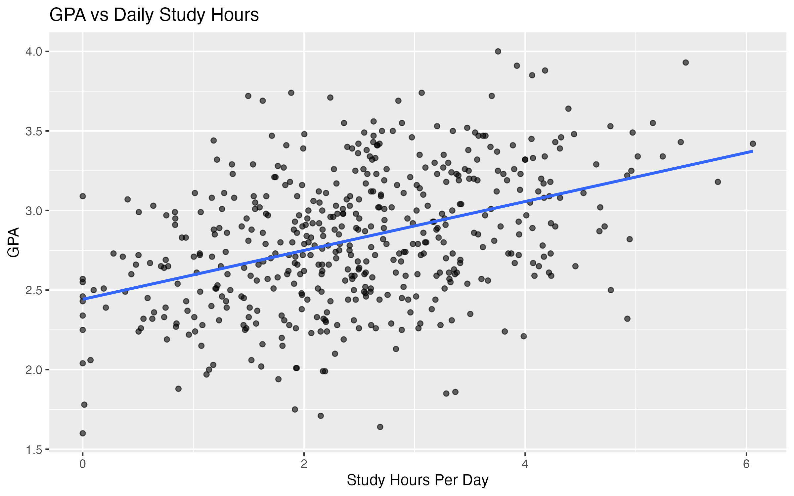
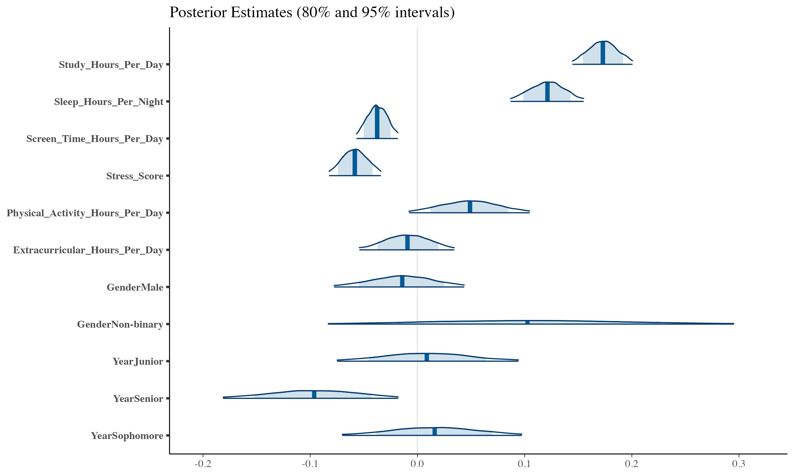

# Student Performance Analysis (Synthetic Data)

This project explores academic performance using a synthetic student dataset through exploratory data analysis and Bayesian regression modeling.

## Project Structure
- `01_generate_data.R`: Generates the synthetic dataset
- `02_eda_analysis.Rmd`: Exploratory data analysis and visualizations
- `03_bayesian_modeling.Rmd`: Bayesian regression with posterior predictive checks
- `data/`: Dataset used for analysis
- `plots/`: Exported figures

## Key Findings
- Study time and sleep show the strongest positive associations with GPA
- Screen time and stress are negatively associated with GPA
- Demographic effects are smaller and more uncertain

## Visuals

### GPA vs Study Hours

### Bayesian Posterior Estimates

## How to Run

1. Run `01_generate_data.R` to generate the synthetic dataset (or use the provided `data/dataset.csv`)
2. Knit `02_eda_analysis.Rmd` to reproduce exploratory analysis and visualizations
3. Knit `03_bayesian_modeling.Rmd` to run the Bayesian regression and diagnostics

## Notes
All results are based on synthetic data and are intended for demonstration purposes only.
